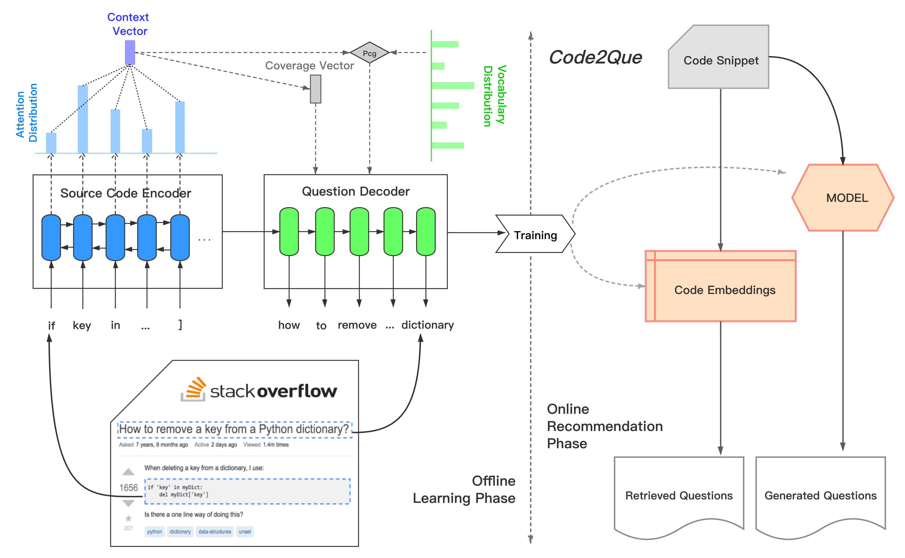

# *Code2Que*: A Tool for Improving Question Titles from Mined Code Snippets in Stack Overflow
***

Stack Overflow is one of the most popular technical Q\&A sites used by software developers, seeking help from Stack Overflow has become an essential part of developers' daily work for solving programming-related questions.
Although the Stack Overflow community has provided quality assurance guidelines to help users to write better questions, we observed that a significant number of questions submitted to Stack Overflow are of low quality. In this paper, we propose a web service tool, named *Code2Que*, which can help developers in writing high quality questions for a given code snippet. 
*Code2Que* consists of two main stages: offline learning and online recommendation. In the offline learning phase, we first collect a set of good quality &lt; *code snippet, question* &gt; pairs as training samples. We then train our model on these training samples via a deep sequence-to-sequence approach, which is enhanced with an *attention* mechanism, a *copy* mechanism and a *coverage* mechanism. In the online recommendation phase, for a given code snippet, we employ the offline trained model to generate question titles to assist less experienced developers in writing questions more effectively. At the same time, we embed the given code snippet into a vector and retrieve the related questions with similar problematic code snippets. To evaluate *Code2Que*, we first sampled 50 low quality &lt; *code snippet, question* &gt; pairs from Stack Overflow for Python and Java datasets. Then we conduct a user study to evaluate the questions generated by our approach as compared to human written ones according to three metrics: *Clearness*, *Fitness* and *Willingness to Respond*. The results show that for a large number of low quality questions in Stack Overflow, *Code2Que* can improve the question titles via *Clearness*, *Fitness* and *Willingness* measures. *Code2Que* can be accessed at http://13.210.12.204:8080. A demo video of *Code2Que* is at \url{TODO}.  

